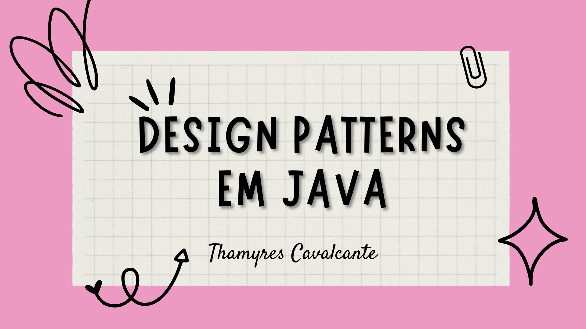

# Projeto Loja Estudo sobre Design Patterns

| :placard: Vitrine.Dev |     |
| -------------  | --- |
| :sparkles: Nome        | **Projeto Loja**
| :label: Tecnologias    | Java, Design Patterns |
| :rocket: URL           | https://github.com/Thamyresmya/Design-Patterns-em-Java

 

  <a href="#-tecnologias">Tecnologias</a>&nbsp;&nbsp;&nbsp;|&nbsp;&nbsp;&nbsp;  
  <a href="#-projeto">Projeto</a>&nbsp;&nbsp;&nbsp;|&nbsp;&nbsp;&nbsp;  
  <a href="#-gif">Gif</a>&nbsp;&nbsp;&nbsp;&nbsp;&nbsp;&nbsp;

 

## 🚀 Tecnologias

Esse projeto foi desenvolvido com as seguintes tecnologias:

- Java
- Design Patterns

 

## 💻 Projeto

Estudo sobre Design Patterns em Java. Como não repita código com Template Method.
A importância de estudar os padrões de projeto. Resolver problemas de muito ifs usando Strategy. Criar diferentes ações com Observer. 

 

## 📁 Acesso ao projeto

É possível acessar o projeto através do [Link](https://github.com/Thamyresmya/Design-Patterns-em-Java)

 

Me siga nas redes sociais:
- [Linkedin](https://www.linkedin.com/in/thamyrescavalcante/)
- [Instagran](https://www.instagram.com/thamyres__cavalcante/)

 

---

Feito com ♥ by Thamyres Cavalcante.

